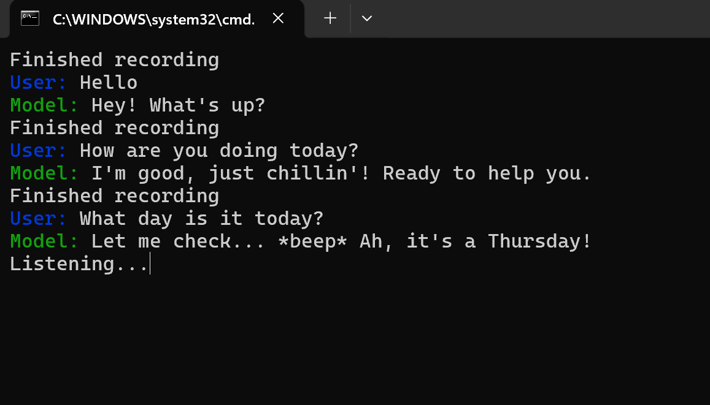

## Voice Chat with LLM
This code starts a voice chat with a LLM. VAD is used to detect start and end of speech. The language and voice models used are:
1. Openai Whisper for audio-to-text transcription;
2. Llama3-8b with Groq api to improve response speed;
3. Openai TTS for text-to-speech.

## Deployment
1. create an .env file
```.env
OPENAI_API_KEY=
GROQ_API_KEY=
```
2. run the following commands
```sh
pip install -r requirement.txt
python app.py
```